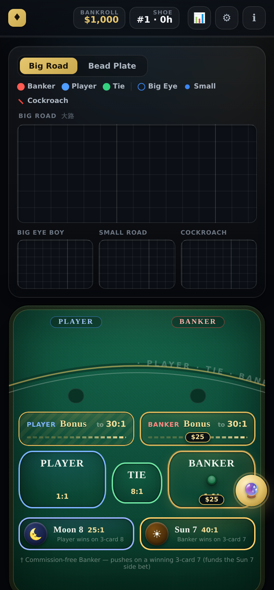
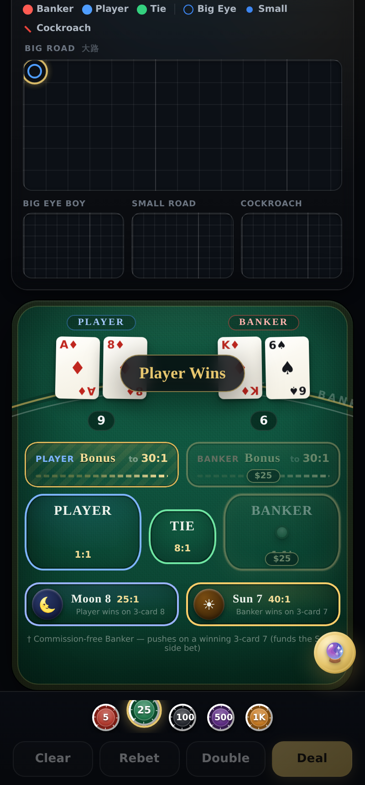
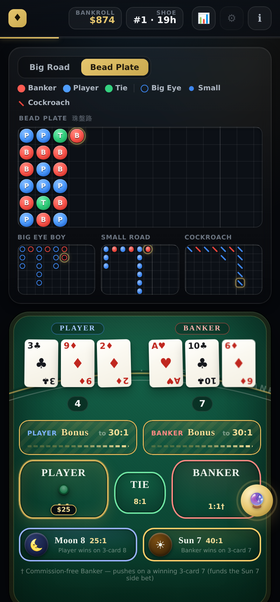

# Baccarat Trainer — Sun 7 / Moon 8

[](https://github.com/ZeusNightBolt/BaccaratTrainer/actions/workflows/ci.yml)
[](https://github.com/ZeusNightBolt/BaccaratTrainer/actions/workflows/deploy.yml)
[](LICENSE)

**Live app: https://zeusnightbolt.github.io/BaccaratTrainer/**

A mini-baccarat trainer built to match how the game is actually spread on the floor at Atlantic City / Resorts World tables — the commission-free "EZ Baccarat" layout with the **Sun 7** (40:1) and **Moon 8** (25:1) side bets, both with adjustable paytables — instead of a generic textbook diagram. Betting felt, chip mechanics, card dealing, and the five live scoreboards are all modeled on real table behavior, with a floating **Road Genie** that reads the shoe the way a table regular would.



## Why this rebuild

The previous version got the math right but nothing about the table felt real: no proper betting layout, no chip mechanics, and no scoreboards. This rebuild keeps the theory and replaces everything around it — the felt layout, the two-chips-per-spot betting feel, card-by-card dealing, and a full roadmap suite — with production-style behavior modeled after the companion Blackjack and Roulette trainers.

## Features

- **Printed Atlantic City felt** — a physically-lit green felt with a woven micro-texture, a black cushion rail with gold piping, and a printed layout arc, rendered entirely in CSS (no image assets). The Player–Tie–Banker zone, the Player Bonus / Banker Bonus corners, and the Moon 8 / Sun 7 medallions are painted onto the felt so the cloth shows through each spot, just like a real table.
- **Player Bonus / Banker Bonus (Dragon Bonus)** — the Resorts World / Atlantic City margin-of-victory side bet, replacing the flat pair bets. Bet a side; a non-natural win pays on a ladder from 1:1 (win by 4) up to **30:1** (win by 9), a natural win pays 1:1, and a natural tie pushes. A winning bonus is announced with its tier ("Player Bonus · Win by 9 · 30:1") so the scaling paytable becomes learnable through play.
- **Real chip mechanics** — pick a denomination ($5/$25/$100/$500/$1,000) off the rail (rendered as clay chips with edge spots), tap a spot to drop chips onto it. Clear, Rebet, and Double all behave like a live table, and the bankroll counter ticks up/down with a colour flash on settle.
- **Card-by-card dealing with a real flip** — cards are dealt face-down in the real order (Player, Banker, Player, Banker, then the third cards), sliding in from the dealer's position before flipping face-up in 3D, with a deliberate held beat before any third card, hand totals updating as each card lands, and a result banner announcing the win.
- **Five live scoreboards, each with its own authentic icon** — laid out like an Atlantic City electronic board (Bead Plate + Big Road side-by-side on wide screens): Bead Plate uses solid B/P/T coins, Big Road uses hollow red/blue rings with green tie slashes and pair dots, and the three derived roads are shape-coded exactly as on a real board — **Big Eye Boy = hollow ring, Small Road = solid dot, Cockroach Road = diagonal slash** — all plotted at their exact grid coordinates with dragon-tail overflow.
- **Road Genie** — a floating pattern-reading assistant in the spirit of the table regulars who narrate the Big Road. She recommends following an active streak by default, calls out regular "chop" patterns (e.g. three-Player/three-Banker repeating) and suggests fading them at a smaller-than-normal unit once the pattern has matured, and cross-reads Big Eye Boy / Small Road / Cockroach Road to say where they agree or disagree. It's folk pattern-reading for flavor, not an edge — every hand is an independent draw from the shoe, and she says so.
- **A real 8-deck shoe** — burn card, cut card, penetration meter, and an automatic reshuffle (with fresh scoreboards) when the cut card is reached.
- **Commission-free Banker** — Banker pays 1:1 with no 5% rake; a Banker win on a three-card 7 pushes instead of paying, which is what funds the Sun 7 side bet, exactly as it works on the real EZ Baccarat felt.
- **Adjustable Sun 7 / Moon 8 paytables** — house ratios for these two side bets vary by casino, so the ⚙ settings panel lets you dial each one in (slider + common presets) between hands, defaulting to 40:1 / 25:1.
- **Session tools** — bankroll tracking (with an automatic practice-bankroll reset if you bust), hand/shoe counters, and a stats panel (hands played, win/loss split, net result).
- **In-app rules reference** — payouts, the third-card draw table, and a plain-English explanation of how to read each scoreboard.




## Rules modeled

| Bet | Pays | Notes |
| --- | --- | --- |
| Player | 1:1 | Push on a tie |
| Banker | 1:1 | Commission-free; pushes (doesn't win) if Banker wins with a 3-card 7 |
| Tie | 8:1 | Player/Banker bets push |
| Player Bonus | 1:1 → 30:1 | Player wins; non-natural win scaled by margin (win by 4→1:1 … 9→30:1), natural win 1:1, natural tie pushes |
| Banker Bonus | 1:1 → 30:1 | Banker wins; same Dragon Bonus margin ladder |
| ☀ Sun 7 | 40:1 (adjustable) | Banker wins with a three-card total of 7 |
| 🌙 Moon 8 | 25:1 (adjustable) | Player wins with a three-card total of 8 |

The Player/Banker Bonus (Dragon Bonus) margin ladder is 4→1:1, 5→2:1, 6→4:1, 7→6:1, 8→10:1, 9→30:1; a win by 3 or fewer loses. Sun 7 and Moon 8 ratios can be retuned per-table from the ⚙ settings panel. Full third-card drawing rules, and how to read each scoreboard, are available from the in-app **info** button.

## Tech stack

Deliberately dependency-free at runtime: vanilla ES modules, no framework, no bundler/build step — so it deploys to GitHub Pages as-is. The only tooling is dev-time: ESLint for linting and Node's built-in test runner for unit tests.

```
index.html            App shell
src/
  styles.css           All styling (casino felt theme, responsive)
  main.js              Wires state + UI together, event handling
  game/                Pure, framework-free game logic (fully unit-tested)
    rules.js            Hand values, third-card draw rules, hand resolution
    shoe.js              8-deck shoe: shuffle, burn, cut card, penetration
    sidebets.js          Bet resolution / payout math (incl. EZ Baccarat push rule)
    bigroad.js           Big Road + Bead Plate + derived "eye" roads
    roadGenie.js         Road Genie pattern-reading logic (streak/chop/agreement)
    state.js             Game/session state machine (bankroll, bets, history)
    *.test.js            Unit tests (node --test)
  ui/                  DOM rendering, no game logic
    table.js             Betting spots, card dealing/flip animation, result banner
    chips.js              Chip rail + contained chip-stack rendering
    cards.js               Card element (face-down/face-up flip) + dealing sequence
    roadmapView.js         Renders the five scoreboards from game state
    roadGenieView.js        Floating Road Genie widget
    payoutSettings.js      Sun 7 / Moon 8 payout ratio editor
    rulesContent.js        In-app rules/help copy
```

## Local development

```bash
npm install
npm start      # serves the app at http://localhost:8080
npm test       # runs the game-logic unit test suite
npm run lint   # ESLint
```

No build step is required — `npm start` just serves the static files.

## CI/CD pipeline

- **`.github/workflows/ci.yml`** — runs on every push/PR to `main`: install, lint, test.
- **`.github/workflows/deploy.yml`** — on push to `main`: re-runs lint/test as a gate, assembles a publish bundle (dropping tests and dev tooling), and deploys it to GitHub Pages via `actions/deploy-pages`.

To enable the live link on a fork, turn on **Settings → Pages → Source: GitHub Actions** once.

## License

MIT — see [LICENSE](LICENSE).
