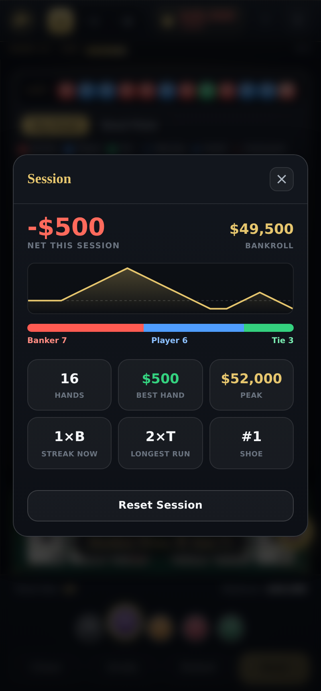

<div align="center">


# Baccarat Dragon Trainer

**A high-limit Atlantic City baccarat table you can practice on — commission-free EZ Baccarat with the Dragon Bonus, Sun 7 / Moon 8 side bets, the full electronic road board, and live coaching.**

[](https://github.com/ZeusNightBolt/BaccaratTrainer/actions/workflows/ci.yml)
[](https://github.com/ZeusNightBolt/BaccaratTrainer/actions/workflows/deploy.yml)
[](LICENSE)

### ▶ [Play it live](https://zeusnightbolt.github.io/BaccaratTrainer/)

</div>


Baccarat Dragon Trainer is a browser baccarat table modeled on a real **Atlantic City / Resorts World high-limit salon** — 8-deck commission-free shoe, $100 minimum, $50,000 buy-in — not a textbook diagram. Every detail is built to feel like the electronic pit: a printed felt, clay chips, card-by-card dealing, and the full glowing **road board** with the Chinese "ask" forecast. It runs entirely in the browser with **zero runtime dependencies** and **no build step**.

## Three modes

| Mode | What it does |
| --- | --- |
| **▦ Play** | The table, straight up. Buy in, place chips, deal, and watch the roads and your bankroll move. |
| **◈ Coach Me** | A persistent coaching rail reads the Big Road and the three derived roads every hand and calls **Follow** or **Fade** — with a confidence read and a gold pulse on the recommended spot. When it fades a mature chop pattern it tells you to size down. |
| **◎ Drill** | A focused road-reading practice loop. The board grows hand by hand and quizzes you — *"Next hand Banker — what mark shows on the Small Road?"* — scoring your accuracy and streak. Powered by the same forecast engine a real board uses. |

## The board — a real Atlantic City electronic display

The scoreboard is a recessed, brass-framed cabinet with a glowing **LED result ticker** and neon road markers, laid out like a real board:

- **Bead Plate** — solid B/P/T coins, filled top-to-bottom.
- **Big Road** — hollow red/blue rings in streak columns, green tie slashes, and pair dots.
- **Big Eye Boy / Small Road / Cockroach Pig** — the three derived "trend" roads, each with its **own authentic icon**: a hollow ring, a solid dot, and a diagonal slash. Red = the shoe is regular; blue = it just broke.
- **Ask (問路) forecast** — the signature electronic-board feature: for the coming hand it shows what mark each derived road *would* get **if the next result is Player** and **if it is Banker**, side by side. This is exactly what a pit board's prediction cells display.


## The table & bets

Commission-free "EZ Baccarat" as spread in AC / Resorts World:

| Bet | Pays | Notes |
| --- | --- | --- |
| Player | 1:1 | Push on a tie |
| Banker | 1:1 | Commission-free; **pushes** if Banker wins with a three-card 7 |
| Tie | 8:1 | Player/Banker push |
| **Player / Banker Bonus** | **up to 30:1** | Dragon Bonus margin ladder — win by 4→1:1, 5→2:1, 6→4:1, 7→6:1, 8→10:1, **9→30:1**; natural win 1:1; natural tie pushes |
| ☀ Sun 7 | 40:1 (adjustable) | Banker wins with a three-card 7 |
| 🌙 Moon 8 | 25:1 (adjustable) | Player wins with a three-card 8 |

The forgone Banker three-card-7 win is exactly what funds the Sun 7 side bet. Sun 7 / Moon 8 ratios are retunable from the ⚙ settings panel; full third-card drawing rules are in the in-app ℹ reference.

## High-limit shoe

Modeled on a real AC high-limit table: **8 decks (416 cards)**, a burn of the first card's value after the shuffle, a cut card placed ~14 cards from the back, and a penetration gauge in the header. When the cut card is reached the shoe is replaced and every road resets together. Chips run **$100 / $500 / $1K / $5K / $25K**; buy in at $50,000, and a bust auto-rebuys so you can keep drilling.

## Session record

The wallet in the header is a live HUD — bankroll with a running net P/L delta and a flash on every settle. Tap it for a **Session** dashboard: a bankroll sparkline, the Banker/Player/Tie split, and your hands, best hand, peak, current streak and longest run. Your wallet and record **persist across reloads** (localStorage).



## Tech

Vanilla ES modules — no framework, no bundler, no runtime dependencies — so it deploys to GitHub Pages as static files. Dev tooling is only ESLint and Node's built-in test runner.

```
index.html              Fixed app shell (HUD · gauge · board · felt · dock)
src/
  styles.css            All styling — casino cabinet, LED board, printed felt
  main.js               Wires state + UI, mode switching, HUD, persistence
  game/                 Pure, framework-free, fully unit-tested logic
    rules.js              Hand values, third-card draw rules, hand resolution
    shoe.js               8-deck shoe: shuffle, burn, cut card, penetration
    sidebets.js           Payout math (EZ push rule, Dragon Bonus ladder)
    bigroad.js            Big Road, Bead Plate, derived roads + Ask forecast
    roadGenie.js          Pattern-reading / follow-fade coaching logic
    state.js              Game/session state machine, high-limit config
    *.test.js             Unit tests (node --test)
  ui/                   DOM rendering, no game logic
    table.js · cards.js · chips.js       Felt, dealing, chips
    roadmapView.js                       The five roads, ticker, Ask forecast
    trainingModes.js                     Play / Coach Me / Drill
    roadGenieView.js · payoutSettings.js · rulesContent.js
```

## Local development

```bash
npm install
npm start      # serves the app at http://localhost:8080
npm test       # game-logic unit suite (node --test)
npm run lint   # ESLint
```

No build step — `npm start` just serves the static files.

## CI / CD

- **`ci.yml`** — install, lint, and test on every push / PR to `main`.
- **`deploy.yml`** — re-runs lint/test as a gate, then publishes to GitHub Pages.

To enable the live link on a fork, turn on **Settings → Pages → Source: GitHub Actions** once.

## License

MIT — see [LICENSE](LICENSE).
